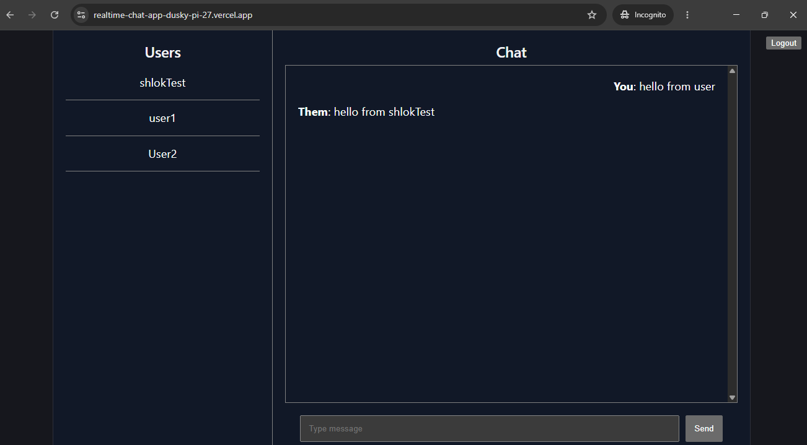
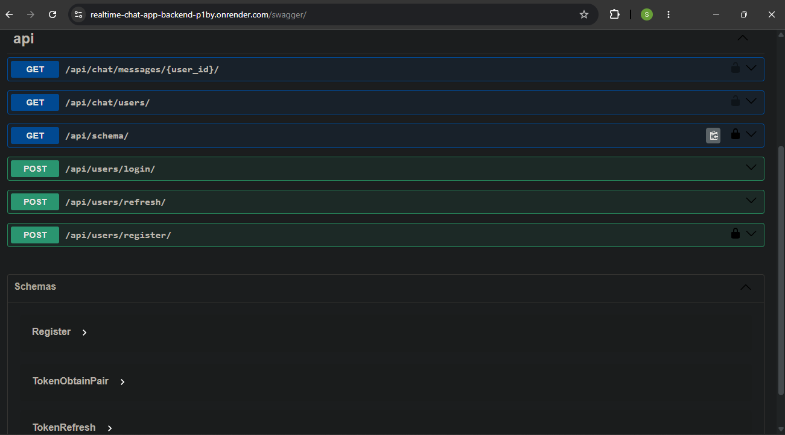
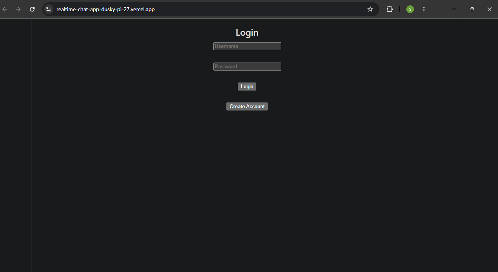

# Realtime Chat Application

A production-style realtime chat application built using Django Channels, WebSockets, Redis, PostgreSQL, React, and Docker.

This project demonstrates full-stack realtime communication architecture with asynchronous websocket handling, JWT authentication, persistent messaging, containerized services, and cloud deployment.

Live Demo: [Frontend Link](https://realtime-chat-app-dusky-pi-27.vercel.app/)
Backend API: [Backend/swagger link](https://realtime-chat-app-backend-p1by.onrender.com/swagger/)

---

# Features

* Realtime one-to-one messaging using WebSockets
* JWT-based authentication
* Persistent message storage with PostgreSQL
* Async websocket consumers using Django Channels
* Redis pub/sub channel layer
* REST APIs with Django REST Framework
* Swagger/OpenAPI documentation
* React frontend with live state updates
* Dockerized multi-container architecture
* Cloud deployment using Render and Vercel

---

# Tech Stack

## Backend

* Django
* Django REST Framework
* Django Channels
* Daphne
* Redis
* PostgreSQL
* drf-spectacular

## Frontend

* React
* Vite
* Axios

## DevOps & Deployment

* Docker
* Docker Compose
* Render
* Vercel

---

# Architecture

```text
React Frontend
       |
HTTP + WebSocket
       |
Django REST + Channels
       |
Redis Channel Layer
       |
PostgreSQL Database
```

---

# Realtime Messaging Flow

```text
1. User sends message from React frontend
2. Message transmitted through WebSocket connection
3. Django Channels consumer receives message
4. Message broadcasted through Redis channel layer
5. Recipient receives realtime update instantly
6. Message persisted into PostgreSQL database
```

---

# API Documentation

Interactive Swagger documentation:


[openAPI documentation](https://realtime-chat-app-backend-p1by.onrender.com/swagger/)


Example endpoints:

```text
POST   /api/users/register/
POST   /api/users/login/
GET    /api/chat/users/
GET    /api/chat/messages/<user_id>/
```

---

# Local Development Setup

## Clone Repository

```bash
git clone https://github.com/shlok-git340/realtime-chat-app.git

cd realtime-chat-app
```

---

# Backend Setup

```bash
cd backend

python -m venv venv

source venv/bin/activate

pip install -r requirements.txt
```

---

# Frontend Setup

```bash
cd frontend

npm install
```

---

# Run with Docker

```bash
docker compose up --build
```

Services:

```text
Frontend  -> localhost:5173
Backend   -> localhost:8000
Postgres  -> localhost:5432
Redis     -> localhost:6379
```

---

# Deployment

## Backend

Deployed on Render

## Frontend

Deployed on Vercel

---

# Key Engineering Concepts Demonstrated

## WebSockets

Persistent bidirectional communication for realtime messaging.

## Redis Pub/Sub

Message broadcasting between asynchronous websocket consumers.

## JWT Authentication

Stateless authentication mechanism for secure API access.

## Django Channels

ASGI-based asynchronous handling for websocket connections.

## PostgreSQL Persistence

Reliable relational storage for messages and users.

## Dockerized Infrastructure

Multi-container orchestration using Docker Compose.

---

# Screenshots


* 
* 
* 


---

# Future Improvements

* Group chat support
* Message delivery status
* Typing indicators
* Media/file sharing
* Online/offline presence
* Read receipts
* Kubernetes deployment
* CI/CD pipeline with GitHub Actions

---

# Project Status

This project was built as a backend-focused realtime systems engineering project to explore:

* asynchronous communication
* websocket architecture
* distributed messaging systems
* containerized deployment workflows

---

